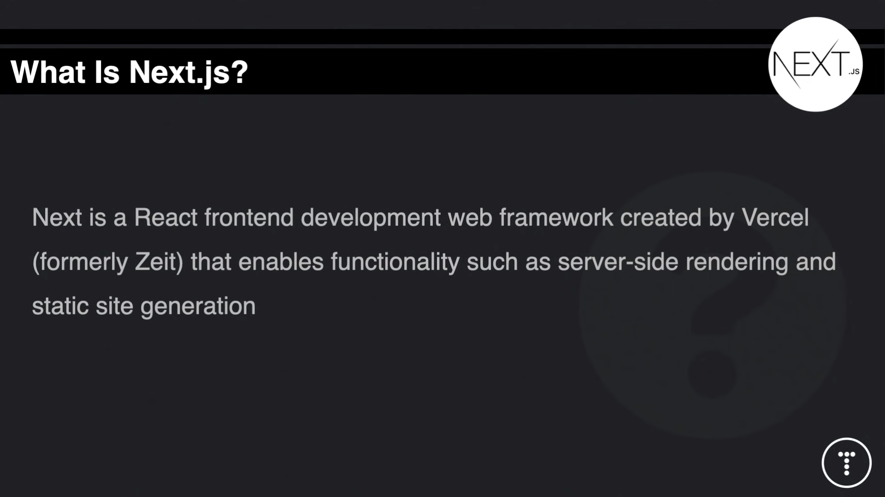
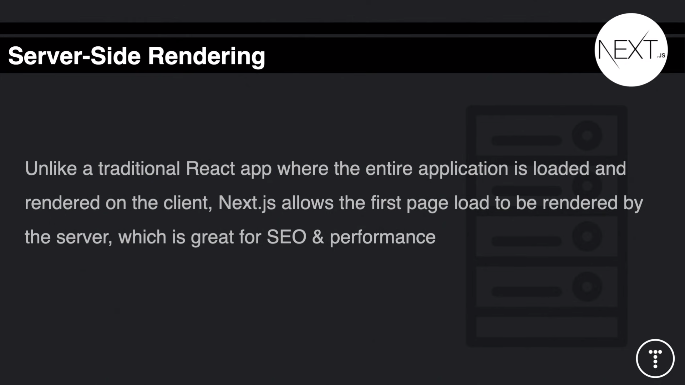

# NextJS

## Why use NextJS ?

Built on top of ReactJS as a frontend web framework consisting of useful features for production.

## Benefits of using NextJS

- Server Side Rendering

  Renderes content on the server making it a great tool for SEO and performance.

  If you open up the page source of an application created with vanilla React vs page source created with NextJS, you will find that all the content of your application like `<h1>, <h2>, 
` will be visible in the NextJS version which is great for web crawlers and SEO unlike in the case of vanilla React where all the content is rendered on the client.

  It renders the content on the server side and sends it to the client in a html page.

  

- Easy Page Routing (Yes built in!, no need for `react-router-dom`)
- API Routes
- Out of the box Typescript and Sass.
- Static Site Generation (next export) [Role of the GatsbyJS]
- Easy Deployment

---

### Important Function `getStaticPaths()`

